### Hi all, I'm Artur 👋

## I'm a Developer, Teacher, and Mentor!

- 📍 I’m From Ukraine (Ivano-Frankivsk)
- 💻 5+ Years Experience in Front-end Development
- 👨‍💻 Front-end Enthusiast & Volunteer
- 📚 Mentor

### 🤝 Connect with me:

[][email]
[][website]
[][linkedin]
[][skype]

### 💻 Tech Stack:

<table>
  <tr>
    <td width="100" height="100">

    </td>
    <td>
      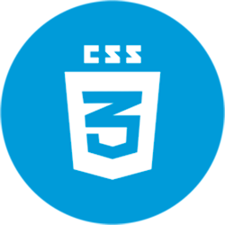
    </td>
    <td>
      
    </td>
    <td>
      
    </td>
    <td>
      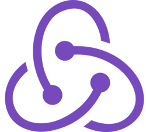
    </td>
  </tr>
  <tr>
    <td>
      
    </td>
    <td>
      
    </td>
    <td>
      
    </td>
    <td>
      
    </td>
    <td>
      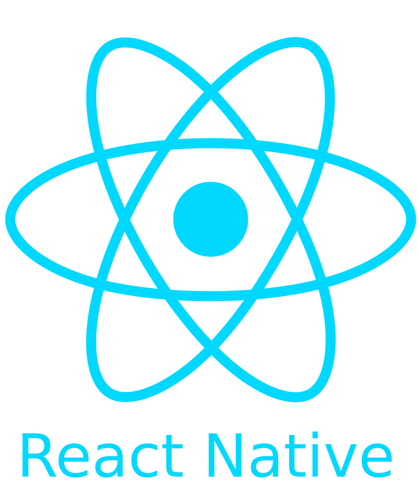
    </td>
  </tr>
  <tr>
    <td>
      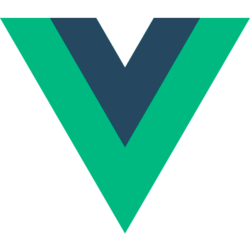
    </td>
    <td>
      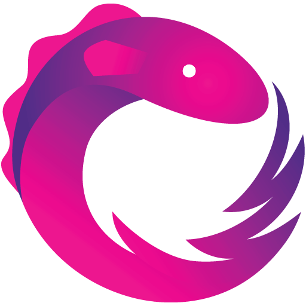
    </td>
    <td>
      
    </td>
    <td>
      
    </td>
    <td>
      
    </td>
  </tr>
  <tr>
    <td>
      
    </td>
    <td>
      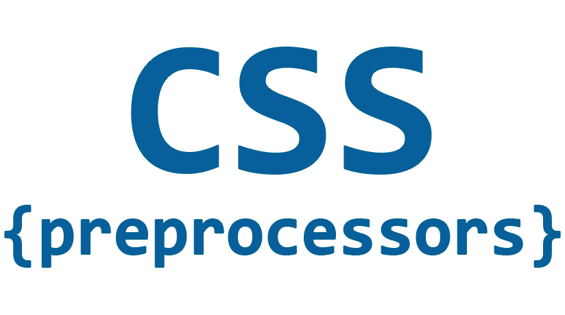
    </td>
    <td>
      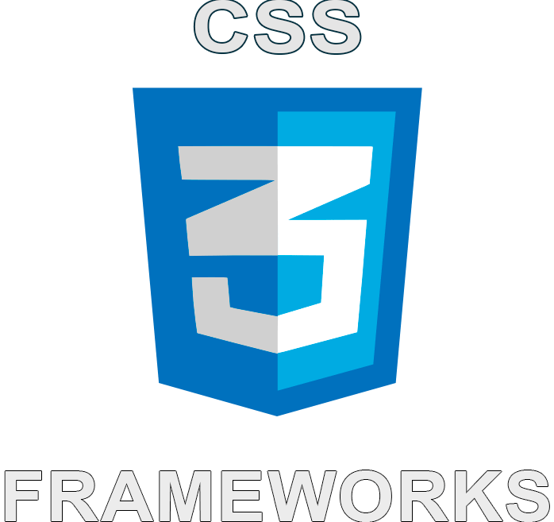
    </td>
    <td>
      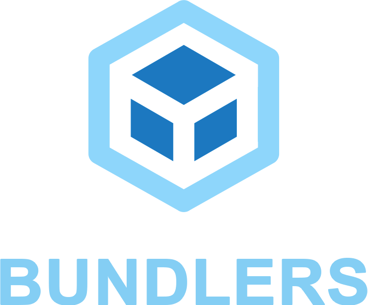
    </td>
    <td>
      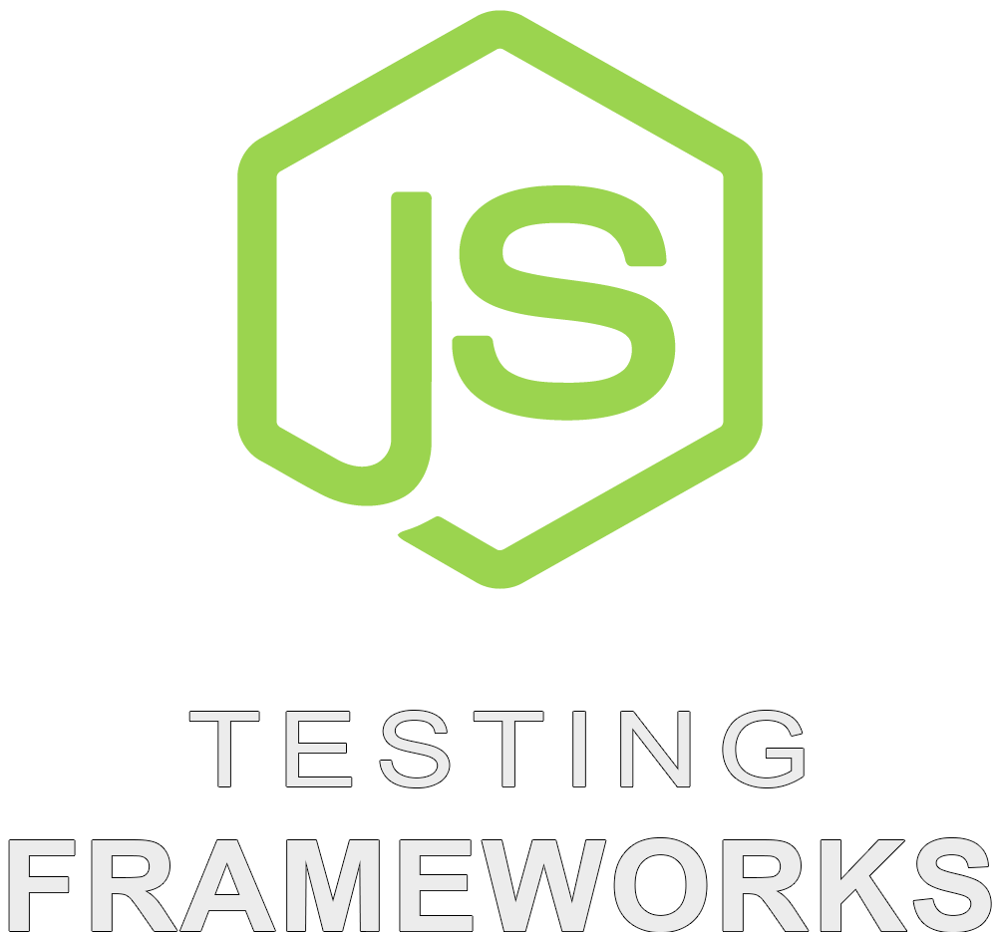
    </td>
  </tr>
  <tr>
    <td>
      
    </td>
    <td>
      
    </td>
    <td>
      
    </td>
    <td>
      
    </td>
    <td>
      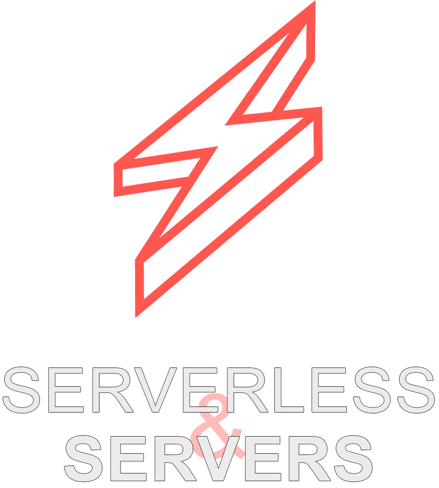
    </td>
  </tr>
  <tr>
    <td>
      
    </td>
    <td>
      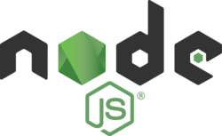
    </td>
    <td>
      
    </td>
    <td>
      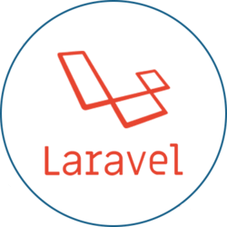
    </td>
    <td>
      
    </td>
  </tr>
</table>

<!--
### 💻 Tech Stack:

&nbsp;
&nbsp;
&nbsp;
&nbsp;
&nbsp;
&nbsp;
&nbsp;
&nbsp;
&nbsp;
&nbsp;
&nbsp;
&nbsp;

&nbsp;

&nbsp;
&nbsp;
&nbsp;
&nbsp;
&nbsp;
&nbsp;
...
 -->

### 🛠 Tools:

&nbsp;
&nbsp;
&nbsp;
&nbsp;
&nbsp;
&nbsp;
&nbsp;
&nbsp;
&nbsp;
&nbsp;

[linkedin]: https://www.linkedin.com/in/artur-voloshyn-4439b61a4/
[email]: mailto:arthurvoloshyn@gmail.com
[skype]: skype:live:32d04c9d781e2d24?chat
[website]: https://arturvoloshyn.herokuapp.com/
